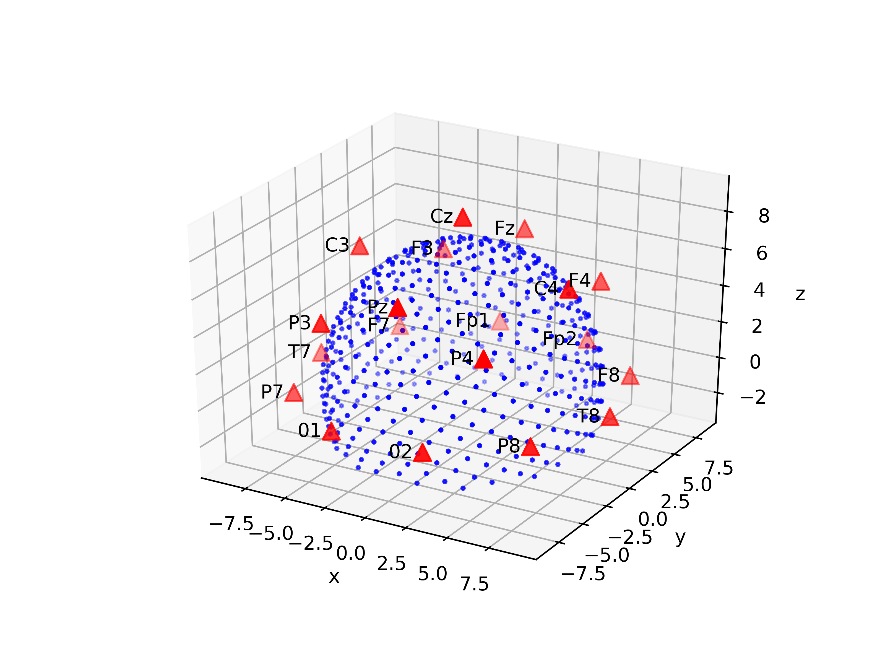

## Forward modeling in EEG

For several applications in EEG, it is interesting to be able to model the electric potential created on a scalp electrode by a small-sized source, modeled as a current dipole. Applications include for example:

* the 'forward model' required before 'inverse modeling', for retrieving the position of the sources a given EEG is generated by. 
* Generation of synthetic EEGs with known spatiotemporal signature for development and testing of subsequent analysis techniques. 

## The 4-sphere model

A classic forward model is the 4-sphere model. 4 concentric spheres respectively represent the cortex, CSF, skull and scalp. A source is modeled by a current dipole and has an amplitude and a 3-dimensional orientation. The potential in a given point on the cortex (electrode) has an analytical solution, obtained by solving the Poisson equation. 

The paper ['Four-sphere head model for EEG signals revisited'](https://www.biorxiv.org/content/biorxiv/early/2017/04/06/124875.full.pdf), by Naess et al. describes this process, corrects some historical errors, and provides the right form for the solution. 

## Multi-source and multi-electrode code

The article linked above provides [code](https://github.com/Neuroinflab/fourspheremodel) for one source and one electrode. This repository generalizes to n_s sources and n_e electrodes placed at specified positions. `mix_mat.py` contains the tools for calculating mixing matrices. 

## Comparison to original code

The various function we use are sanity-checked in `test_mix_mat.py` and the values of mixing coefficients are numerically checked against values from the original code. 

## Speed

The code is vectorized, and approximately 200 times faster than looping the original code (benchmark done for 1000 sources and 19 electrodes). 

## Temporal activations

The afore-presented mixing is instantaneous. In our case we use this code for generating synthetic EEGs and testing analytical models. For generating actual EEGs, each source must be given a temporal analysis. `synth_eeg_graph.py` presents an example of how to do this in a tensorflow graph. 
